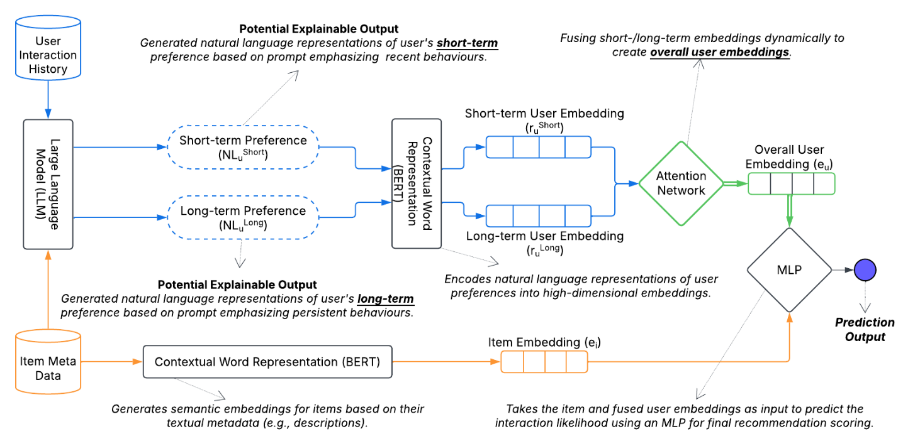
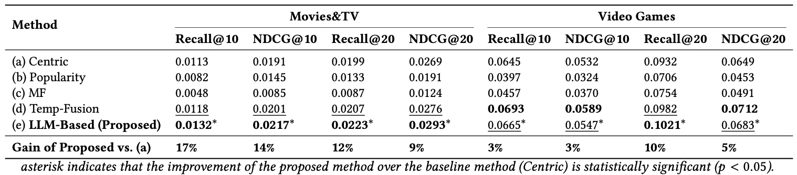
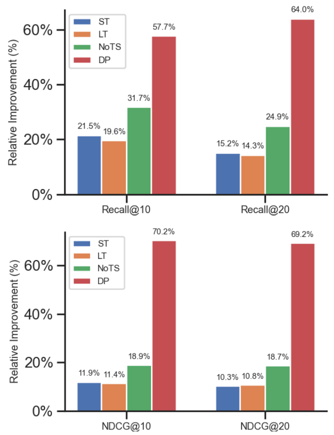

# Towards Explainable Temporal User Profiling with LLMs 
 

## 📌 Overview  
  

Accurately modeling user preferences is vital not only for improving recommendation performance but also for enhancing transparency in recommender systems. Conventional user-profiling methods—such as averaging item embeddings—often overlook the evolving, nuanced nature of user interests, particularly the interplay between short-term and long-term preferences. In this work, we leverage large language models (LLMs) to generate natural language summaries of users’ interaction histories, distinguishing recent behaviors from more persistent tendencies. Our framework not only models temporal user preferences but also produces natural language profiles that can be used to explain recommendations in an interpretable manner. These textual profiles are encoded via a pre-trained model, and an attention mechanism dynamically fuses the short-term and long-term embeddings into a comprehensive user representation. Beyond boosting recommendation accuracy over multiple baselines, our approach naturally supports explainability: the interpretable text summaries and attention weights can be exposed to end users, offering insights into why specific items are suggested. Experiments on real-world datasets underscore both the performance gains and the promise of generating clearer, more transparent justifications for content-based recommendations.

Proposed Architecture for LLM-Driven Explainable Temporal User Profiling

---

## 🚀 Key Features  
- **LLM-Driven Profiling**: Uses OpenAI’s GPT-4o-mini to transform interaction histories into **natural language preference representations**.  
- **Temporal Awareness**: Captures both **short-term** and **long-term** user behaviors, ensuring personalized recommendations.  
- **Attention-Based Fusion**: Dynamically combines short-term and long-term embeddings for each user, **personalizing weight distribution**.  
- **Seamless Integration**: Designed to be compatible with **existing recommendation models**, enhancing user representations without requiring architectural changes.  

---

## 🏗️ Components  
### 1️⃣ **User Profile Generation with LLMs**  
- The **entire interaction history** (with timestamps) is passed to the **LLM twice**:  
  - **Pass 1**: Generates a **short-term preference profile**.  
  - **Pass 2**: Generates a **long-term preference profile**.  

### 2️⃣ **Embedding Creation with BERT**  
- Both **LLM-generated textual representations** are **encoded into embeddings** using a **pre-trained BERT model**.  

### 3️⃣ **Attention-Based Fusion**  
- The **short-term and long-term embeddings** are **dynamically weighted** using an **attention mechanism**, adapting to each user’s behavioral patterns.  

### 4️⃣ **Final Recommendation Prediction**  
- The **fused user embedding** is combined with **item embeddings** and passed through an **MLP** to predict interaction likelihood.  

---
Performance Comparison our proposed method and baselines on Movies\&TV and Video Games datasets for \(K=10\) and \(K=20\).

---
Comparison of the proposed method against ablated variants on the Movies dataset, illustrating how each approach ranks items (Recall@10, Recall@20) and captures relevance (NDCG@10, NDCG@20) at various cutoff points.
